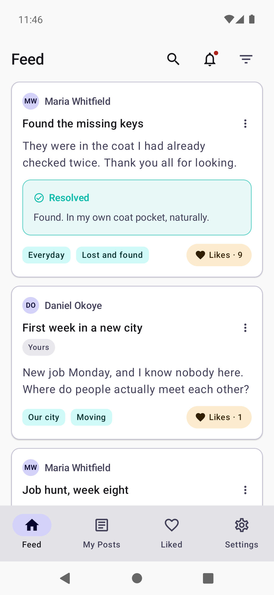
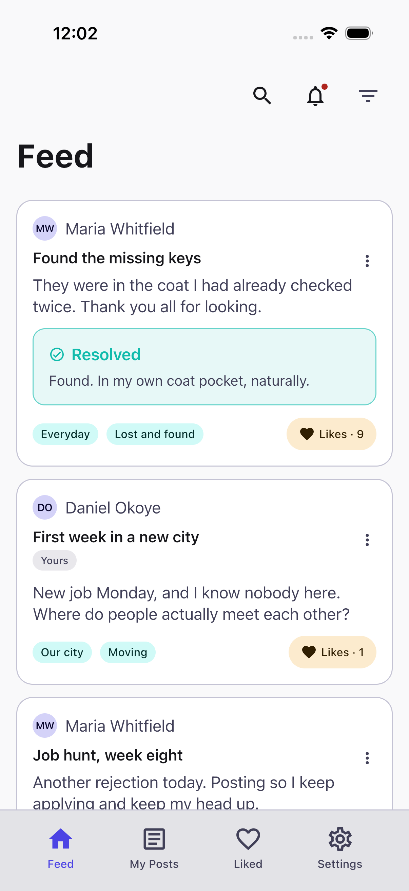
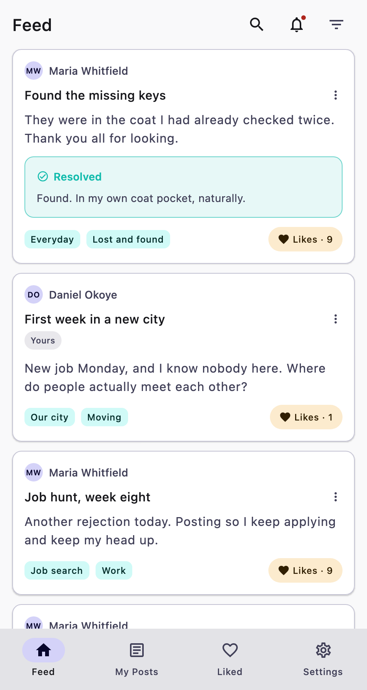
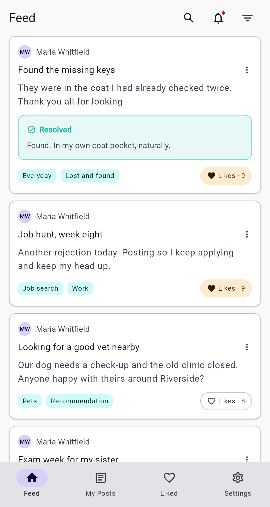

# Poster — a Kotlin Multiplatform app template with a real backend

Poster is a complete, working "posts + likes + groups" app for **Android and iOS**
(and optionally **desktop and the browser**), with a **Ktor server**, an **admin panel**, sign-in
(email, magic link, Google, Apple), comments, images, follows, bookmarks, push
notifications, an offline cache with an outbox, in-app purchases, screenshots
tooling and a deploy pipeline. It is meant to be forked: change a properties
file, run one rename script, and you have your own app to fill with your own
product. It also carries its own instructions for AI coding assistants
([`CLAUDE.md`](CLAUDE.md), [`docs/AIAssistant.md`](docs/AIAssistant.md)), so
"make this my app" is one command away.

It grew out of a shipped app and was scrubbed into a template, so the parts that
usually take months — auth, email, moderation, store compliance pages, CI — are
already there and already tested.

```
┌─────────────┐  ┌─────────────┐
│  Android    │  │    iOS      │   composeApp/   Compose Multiplatform UI, ViewModels
│  (Compose)  │  │  (Compose)  │   shared/       models, API clients, SQLDelight cache, Koin
└──────┬──────┘  └──────┬──────┘   server/       Ktor + SQLite, JWT auth, admin panel
       └────── HTTPS ───┴──────►   iosApp/       Xcode project (Swift shell + bridges)
                    ┌─────────┐
                    │  Ktor   │   one JAR, one SQLite file, one Docker image
                    │ server  │
                    └─────────┘
```

## Screenshots

The same feed on every platform, from the running app with demo data. Click a
platform for its full set (light and dark, every screen).

<table>
  <tr>
    <th><a href="screenshots/android.md">Android</a></th>
    <th><a href="screenshots/ios.md">iOS</a></th>
    <th><a href="screenshots/desktop.md">Desktop</a></th>
    <th><a href="screenshots/web.md">Web</a></th>
  </tr>
  <tr>
    <td><a href="screenshots/android.md"></a></td>
    <td><a href="screenshots/ios.md"></a></td>
    <td><a href="screenshots/desktop.md"></a></td>
    <td><a href="screenshots/web.md"></a></td>
  </tr>
</table>

Regenerate them with the capture scripts (`docs/Screenshots.md`); the pages
under `screenshots/` are written by `scripts/screenshot-pages.sh`.

## What you get

**Supported and working**

| Area | What is in the box |
|---|---|
| Posts | Create, edit, delete. Title + text, up to 5 tags, language, visibility (everyone / one group / only me). Feed with cursor paging, pull to refresh, "N new posts" offer, offline cache. |
| Likes | Like/unlike with undo, like counts, a "Liked" tab, an opt-in "who liked this" roster. |
| Desktop | Optional JVM desktop app with the same code (`feature.desktop`, off by default, needs `feature.support=false`; see docs/Desktop.md). |
| Web | Optional browser app (Kotlin/Wasm) with the same code, online only, served by the Ktor server or any static host (`feature.web`, off by default; see docs/Web.md). |
| Offline outbox | Posts written or edited offline wait on the device and are sent on the next refresh (`feature.offlineOutbox`). |
| Bookmarks & drafts | Save posts for later (private) with a "Saved" feed filter; an unsent post is kept on the device and restored (`feature.bookmarks`, `feature.drafts`). |
| Follows | Follow people from a post's author line; a "Following" feed filter (`feature.follows`, needs authors). |
| Groups | Invite-only or public groups: create, join by code, emailed invitation (single-use) or from the public list, owner and admins, member management, leave/close, deep links `poster://join/CODE`. |
| Search | Free text over title and message, server-side so it reaches past the loaded page, combined with the tag and group filters. |
| Tags | Curated, grouped, bilingual tag catalogue seeded on the server and editable in the admin panel; tag + group filtering on the feed (server-side, so it reaches beyond the loaded page). |
| Sharing | Public share links (`https://your.domain/p/TOKEN`) with a read-only web page and an in-app deep link. |
| Resolution | "Mark as resolved" with an optional outcome message; resolved posts fade from the feed after a day. |
| Activity & push | An activity list (likes, comments, group news) on the server and a bell on Home; pushes through FCM and APNs when keys are configured, logged otherwise. Tokens registered on sign-in, withdrawn on sign-out. `feature.pushNotifications`. |
| Comments | A text thread under each post: read where the post is visible, removable by the writer or the post's author, hidden from the admin panel, counted on cards. `feature.comments`. |
| Images | One picture per post: system photo picker (no permissions), downscaled on the device, stored by the server under the post's visibility, shown on cards, details and the share page, deleted with the post. `feature.images`. |
| Liquid design | Optional "liquid" look: rounder shapes and translucent cards (`feature.liquidDesign`) and a floating glass tab bar over the content (`feature.liquidNavBar`), drawn by Compose on both platforms. |
| Accounts | Email + password (Argon2id), email verification, password reset, 15-min access / 30-day rotating refresh tokens, Keystore/Keychain token storage, account deletion (in-app and web), account merge for Apple hidden-email sign-ups. |
| Authors | Optional (on by default): name and avatar on posts and comments, a profile picture. Off keeps the anonymous default where a name shows only where the person opted in. `feature.authors`. |
| Passwordless sign-in | "Email me a link": a fifteen-minute, single-use link that signs in on the device and confirms the address. Sign-in only; registering stays the first step. `feature.magicLink`. |
| Google sign-in | Credential Manager on Android, native SDK on iOS, token verification on the server. |
| Apple sign-in | Native on iOS; browser round-trip on Android through the server. |
| In-app purchases | RevenueCat "support the developer" tiers (one-off + subscription), Customer Center, remote kill switch. Swappable out of the build entirely. |
| Server | Ktor 3, SQLite via SQLDelight, versioned migrations with pre-migration snapshots, nightly backup script, health endpoint, crash + diagnostic event intake, Telegram alerts, Resend email. |
| Admin panel | `/admin`: users (ban, reset password, verify), posts (hide/restore, language), reports, feedback with replies, tags (labels, groups), groups, crashes, events, audit log. |
| Web pages | Landing, privacy, terms, child-safety standards, verify/reset/delete-account pages, invitation landing, share page — all bilingual, dark-mode aware, no external assets. |
| Feedback | In-app feedback screen with developer replies. |
| Reminders | A local daily notification at a chosen time (Android alarm + iOS notification). |
| Themes & i18n | Light/dark (follow system or manual), English + Russian, platform-adaptive controls (Material on Android, iOS-flavoured on iPhone). |
| Tooling | Feature flags + palette from one properties file, rename script, environment doctor, device tunnel helper, screenshot capture (Android + iOS) and store-image composition, icon generation, architecture checks, GitHub Actions CI + server deploy + tag-driven releases to the Play internal track and TestFlight. |
| Tests | Server route tests (~400), shared unit tests, ViewModel tests, an Android instrumented suite (25 classes), an iOS XCUITest suite. |

**Not yet supported** (see [`docs/Roadmap.md`](docs/Roadmap.md))

- More than one image per post (or video/files), blocking users, multiple servers/tenancy, an offline cache in the browser (the web app is online only), Postgres (SQLite only; the seam is documented in `docs/Database.md`).

## Five-minute start

```bash
git clone <your fork> my-app && cd my-app
scripts/doctor.sh                                  # what is installed, what is missing
scripts/rename-app.sh --package com.acme.chirp --app-id com.acme.chirp \
                      --name "Chirp" --scheme chirp --domain chirp.acme.com
$EDITOR poster.properties                          # features on/off, colours
scripts/run-local-backend.sh                       # Ktor on http://localhost:8080
scripts/seed-demo-data.sh --host localhost:8080 --reset   # demo accounts + posts (demo.reader.en@example.com / demo123456)
./gradlew :composeApp:installE2eDebug              # Android emulator, talks to that server (the `remote` flavour needs a deployed server)
open iosApp/iosApp.xcodeproj                       # iOS simulator, same server
```

Then read [`docs/GettingStarted.md`](docs/GettingStarted.md) and work through
[`docs/AdaptationChecklist.md`](docs/AdaptationChecklist.md) — every change,
addition and removal that turns the template into your app, in order. Using an
AI assistant? `CLAUDE.md` holds the same list as a playbook; in Claude Code,
`/adapt-template` runs it. Everything below is a pointer into `docs/`.

## Configure

- [`poster.properties`](poster.properties) — the one file to edit: app name, URL
  scheme, domain, **feature flags**, and **two seed colours** from which the whole
  light and dark palette is derived (app, web pages, store graphics; text
  contrast checked at build time). Gradle turns it into constants
  (`Features.LIKES`, `BrandPalette.Light.primary`, `AppInfo.NAME`) that Android,
  iOS and the server all read. Off means compiled out. → [`docs/Configuration.md`](docs/Configuration.md)
- [`scripts/rename-app.sh`](scripts/rename-app.sh) — package, application id, name,
  scheme, domain across the whole tree. → [`docs/Renaming.md`](docs/Renaming.md)
- Push notifications and the activity list → [`docs/PushNotifications.md`](docs/PushNotifications.md) · Comments → [`docs/Comments.md`](docs/Comments.md) · Images on posts (storage, visibility, limits) → [`docs/Images.md`](docs/Images.md) · Liquid design flags → [`docs/LiquidDesign.md`](docs/LiquidDesign.md)
- Sign-in providers → [`docs/SignIn.md`](docs/SignIn.md) · Purchases → [`docs/InAppPurchases.md`](docs/InAppPurchases.md) · Email → [`docs/Email.md`](docs/Email.md)
- Follows, bookmarks, public groups → [`docs/Social.md`](docs/Social.md) · Offline cache, outbox, drafts → [`docs/Offline.md`](docs/Offline.md) · Desktop target → [`docs/Desktop.md`](docs/Desktop.md) · Web target → [`docs/Web.md`](docs/Web.md)

## Run

- Local server, emulator, simulator, real phones over USB/LAN/tunnel → [`docs/GettingStarted.md`](docs/GettingStarted.md)
- Server environment variables, admin panel, fixtures, backups → [`docs/Server.md`](docs/Server.md)
- Deploying the server (Docker image, GitHub Actions, any host) → [`docs/Deployment.md`](docs/Deployment.md)
- Release signing and version numbers → [`docs/ReleaseSigning.md`](docs/ReleaseSigning.md)
- Store listings (Play / App Store checklists, the pages they require) → [`docs/StoreListing.md`](docs/StoreListing.md)

## Change

- How the code is organised and how to add a screen, a field, an endpoint → [`docs/Architecture.md`](docs/Architecture.md)
- Database schema and migrations → [`docs/Database.md`](docs/Database.md)
- Adding a language → [`docs/Localization.md`](docs/Localization.md)
- Tests: unit, server, instrumented, iOS UI → [`docs/Testing.md`](docs/Testing.md)
- Screenshots and store images → [`docs/Screenshots.md`](docs/Screenshots.md)
- Working with an AI assistant (Claude Code, Codex, Cursor, Copilot) → [`docs/AIAssistant.md`](docs/AIAssistant.md) · the phased playbook → [`CLAUDE.md`](CLAUDE.md) · the human checklist → [`docs/AdaptationChecklist.md`](docs/AdaptationChecklist.md)
- What is left on the roadmap → [`docs/Roadmap.md`](docs/Roadmap.md)

## Repository layout

```
poster.properties        features, colours, identity  (edit this)
gradle.properties        public build-time ids (Google/Apple client ids), JVM args
composeApp/              Compose Multiplatform app: ui/, viewmodel/, theme/, preview/
  src/commonMain         shared UI
  src/androidMain        Android entry point, notifications, sign-in, adaptive controls
  src/iosMain            iOS entry point, adaptive controls
  src/desktopMain        JVM desktop entry point and adaptive controls (feature.desktop)
  src/wasmJsMain         browser entry point, index.html, adaptive controls (feature.web)
  src/billing/{enabled,disabled}   RevenueCat code, swapped by feature.support
  src/push/{enabled,disabled}      Firebase Messaging, swapped by feature.pushNotifications
  src/androidTest        instrumented suite (needs the local server)
shared/                  domain models, validation, Ktor clients, SQLDelight schema, Koin
  src/commonMain/sqldelight   *.sq schema, migrations, databases/<v>.db baselines
server/                  Ktor backend: routes, auth, admin panel, web pages, mail, alerts
iosApp/                  Xcode project, Config.xcconfig, Swift bridges, XCUITests
scripts/                 run/seed/screenshot/build/rename/doctor/tunnel helpers
docs/                    everything a maintainer needs
assets/                  SVG sources for icons and the mark, fonts, Apple sign-in logos
.github/workflows/       CI (tests, flags-off matrix, desktop, iOS build), server deploy, tag-driven releases
CLAUDE.md, AGENTS.md     instructions for AI coding assistants; .claude/commands/ the slash commands
```

## Requirements

JDK 21, Android Studio (SDK 24–37), Xcode 16+ for iOS, and for the optional
graphics scripts `librsvg` + `imagemagick`. `scripts/doctor.sh` checks all of it.

## Licence

MIT — see [`LICENSE`](LICENSE). Roboto (assets/fonts) is Apache 2.0; the Apple
sign-in logo assets are Apple's and subject to their guidelines.
