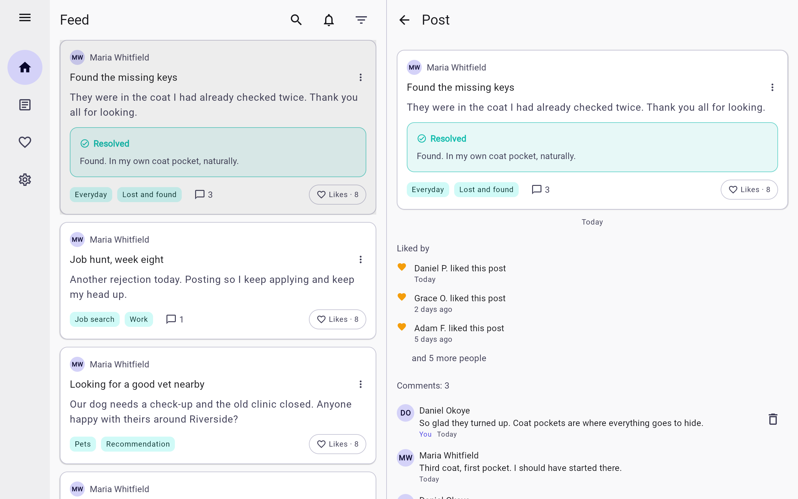

# Web (Kotlin/Wasm) target

`feature.web=true` in `poster.properties` adds `wasmJs()` to `shared` and
`composeApp`. Off by default, for the same reasons as desktop: it changes
dependency resolution for every build, and the billing SDK (`feature.support`)
has no browser build — the Gradle script refuses `web=true` with
`support=true` and says so.

```
feature.web=true
feature.support=false
scripts/run-local-backend.sh                          # the API on :8080
./gradlew :composeApp:wasmJsBrowserDevelopmentRun     # the app on http://localhost:8081
```

For a build to ship: `./gradlew :composeApp:wasmJsBrowserDistribution` writes
`composeApp/build/dist/wasmJs/productionExecutable/` (an `index.html`, a web manifest and icon, the loader `poster.js`, two `.wasm`
files — Compose's Skia and the app — and the resources; about 17 MB
uncompressed). The Ktor server gzips what it serves; another host should too.

## Where the API is

| Situation | What the app calls |
|---|---|
| Served by the Ktor server (`POSTER_WEB_DIR=<the dist folder>` → `https://your.domain/app/`) | Its own origin. No CORS, no second host. **Recommended.** |
| The Kotlin dev server on `:8081` | `http://<same host>:8080`. The server allows that origin in development mode. |
| Anywhere else (a CDN, another domain) | `<meta name="poster-server" content="https://api.your.domain">` in `index.html`, and that origin listed in `POSTER_WEB_ORIGINS` on the server (comma separated). |

Tokens travel in the `Authorization` header, never in cookies, so allowing an
origin does not hand it a session; CORS is only about which pages may call.

## What is different in the browser

| Concern | Web |
|---|---|
| Storage | **No SQLite.** `PostRepository` runs without a `PostLocalStore`: the feed is fetched, not cached; My Posts and Liked come from their requests; the offline outbox and drafts are off (the flags are ignored there). Preferences and the session live in `localStorage`. |
| Look | The Android (Material 3) components, the same file as the desktop actuals. Below 840 px the phone layout with a bottom bar; above it a left rail (icons, expandable to titles) and the post beside the list. |
| Images | `<input type="file">`; the file goes up as it is (no re-encoding in the browser), so the 5 MB limit applies to the original. |
| Sharing | Copies the link to the clipboard. |
| Sign-in | Email and password, magic link (the link opens the web app when `app.webOrigin` is where the app is served). No Google or Apple sign-in. |
| Notifications, daily reminder, push | Not available; the switches report that. |
| Time zones | `kotlinx-datetime` on Wasm reads them from `@js-joda/timezone` (an npm dependency of `composeApp`). |

## What it looks like

| Narrow (bottom bar) | Wide (rail, two panes) |
|---|---|
|  |  |

All shots: [`screenshots/web.md`](../screenshots/web.md).

## Adding the SQLite cache later

SQLDelight's web-worker driver (sql.js over IndexedDB) works with `wasmJs`, but
it is asynchronous: turning it on means `generateAsync = true` for the whole
database and `awaitAsList()` at every query in `shared` and `server`. That is
why the browser build goes without the cache; when the app is worth it, the
seam is `PostLocalStore` (make it an interface with a browser implementation)
and `Main.kt`, which is where `localStore = null` is decided.

## CI

The `web` job compiles both targets and builds the distribution with the flag
on and billing off.
