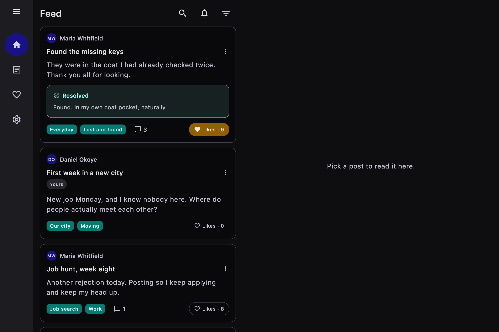
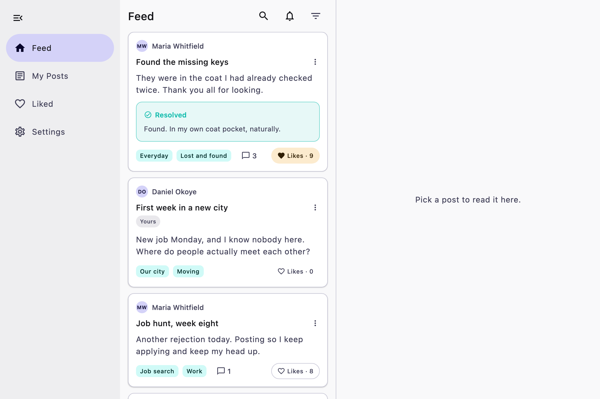

# Desktop (JVM) screenshots

Captured from the running app with demo data, in the default palette. How: `scripts/desktop-screenshots.sh`: the desktop app renders itself into PNGs headlessly (`POSTER_RENDER_TO`), signed in as the demo reader (docs/Desktop.md).

[← README](../README.md) · other platforms:
[Android](android.md) · [iOS](ios.md) · [iOS with the native bar turned off](ios-docked.md) · [iPad](ipad.md) · [Web (Kotlin/Wasm)](web.md) · 

## feed

<table><tr><th>Light</th><th>Dark</th></tr><tr><td></td><td></td></tr></table>

## wide feed

<table><tr><th>Light</th><th>Dark</th></tr><tr><td></td><td></td></tr></table>

## wide rail expanded

<table><tr><td></td></tr></table>

