# iOS, Liquid Glass tab bar screenshots

Captured from the running app with demo data, in the default palette. How: the same run with `feature.liquidNavBar=true`: the tabs are a SwiftUI TabView, the system's Liquid Glass bar on iOS 26 (docs/LiquidDesign.md).

[← README](../README.md) · other platforms:
[Android](android.md) · [iOS](ios.md) · [iPad](ipad.md) · [Desktop (JVM)](desktop.md) · [Web (Kotlin/Wasm)](web.md) · 

## home

<table><tr><th>Light</th><th>Dark</th></tr><tr><td>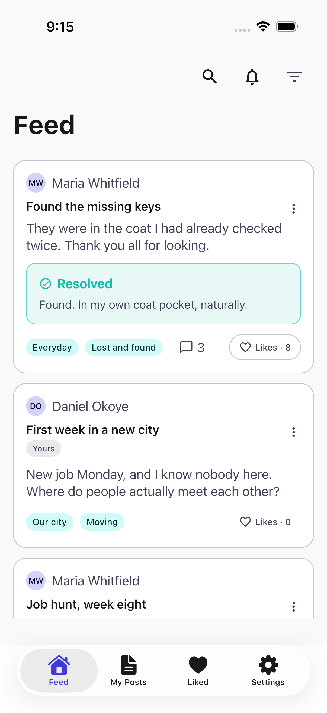</td><td>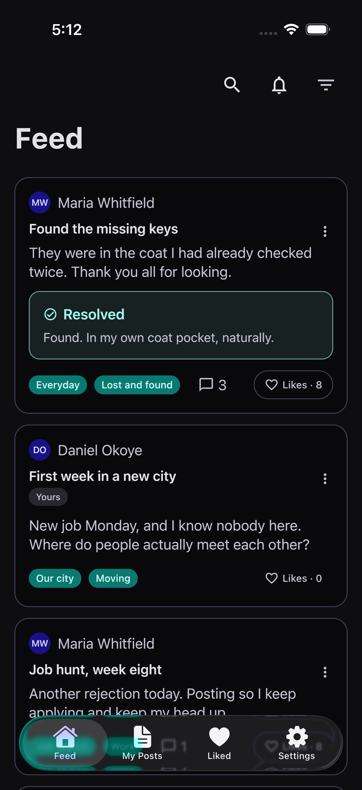</td></tr></table>

## my posts

<table><tr><td>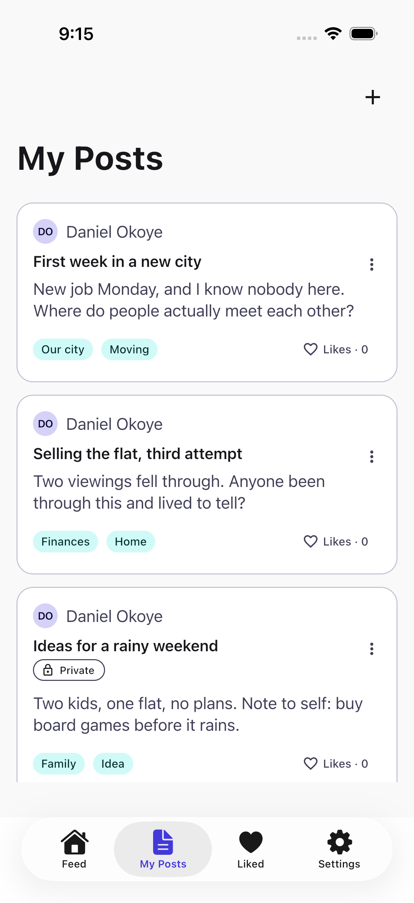</td></tr></table>

## add post

<table><tr><td>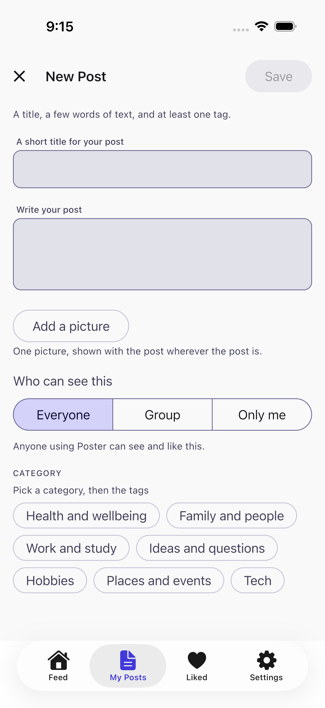</td></tr></table>

## delete confirmation

<table><tr><td>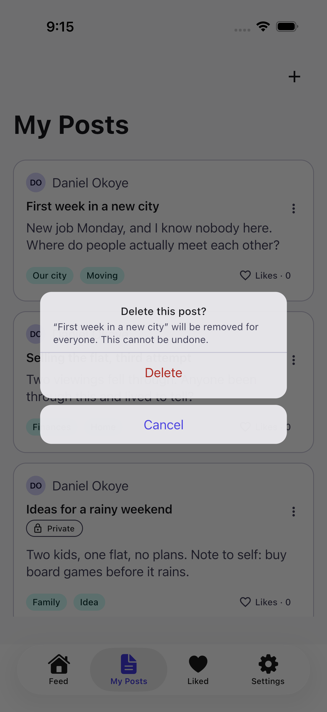</td></tr></table>

## liked

<table><tr><td>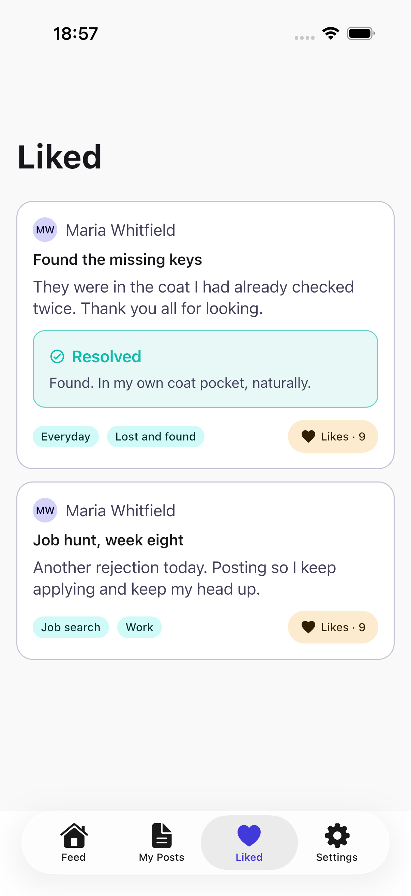</td></tr></table>

## settings

<table><tr><th>Light</th><th>Dark</th></tr><tr><td>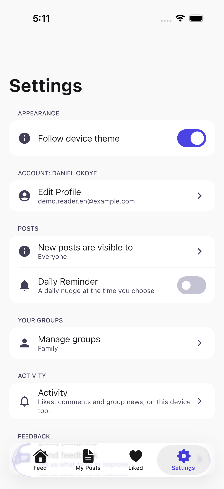</td><td>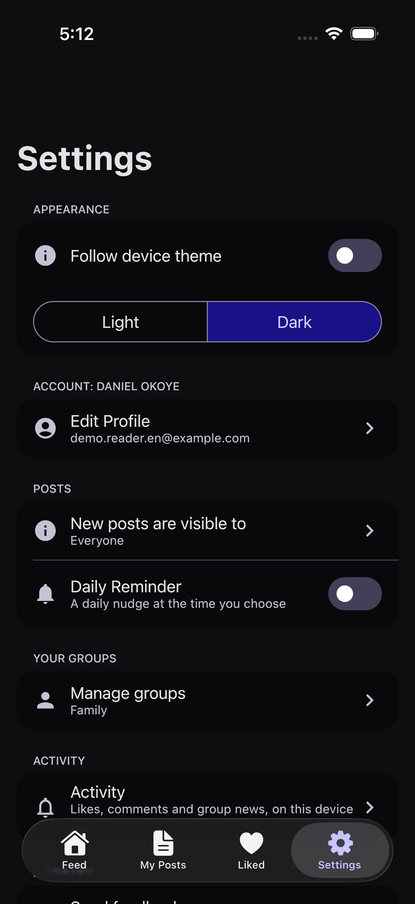</td></tr></table>

## groups

<table><tr><td>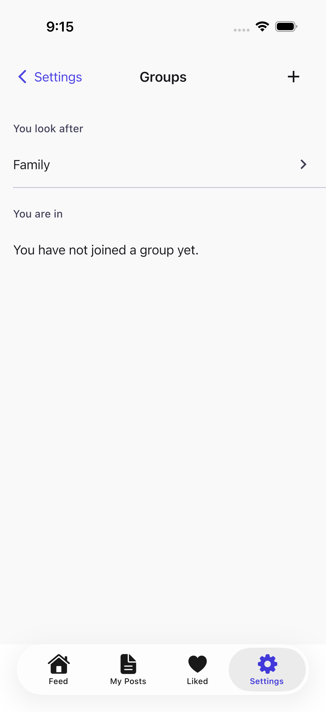</td></tr></table>

## post details

<table><tr><td>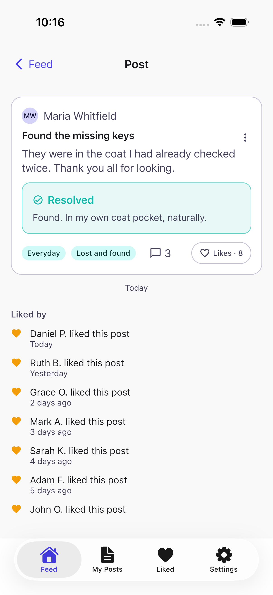</td></tr></table>

## support paywall

<table><tr><td>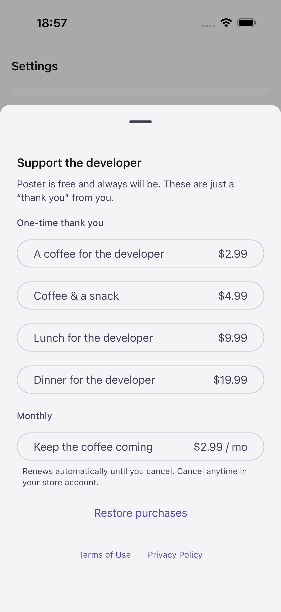</td></tr></table>

## profile

<table><tr><td>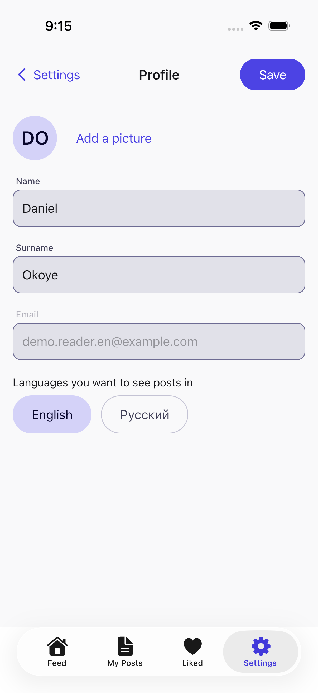</td></tr></table>

## 00-login

<table><tr><td>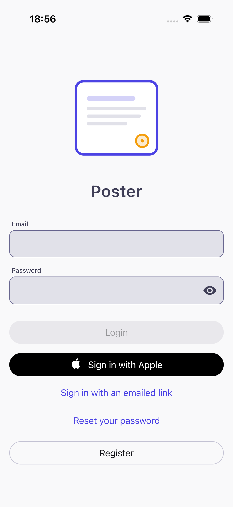</td></tr></table>

## 00b-register

<table><tr><td>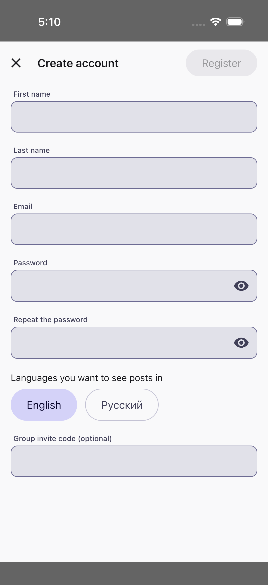</td></tr></table>

