# iOS screenshots

Captured from the running app with demo data, in the default palette. How: `scripts/ios-screenshots.sh` on a simulator against the local backend; the app is driven by the XCUITest suite (docs/Screenshots.md).

[← README](../README.md) · other platforms:
[Android](android.md) · [iOS, Liquid Glass tab bar](ios-liquid.md) · [Desktop (JVM)](desktop.md) · [Web (Kotlin/Wasm)](web.md) · 

## home

| Light | Dark |
|---|---|
|  | 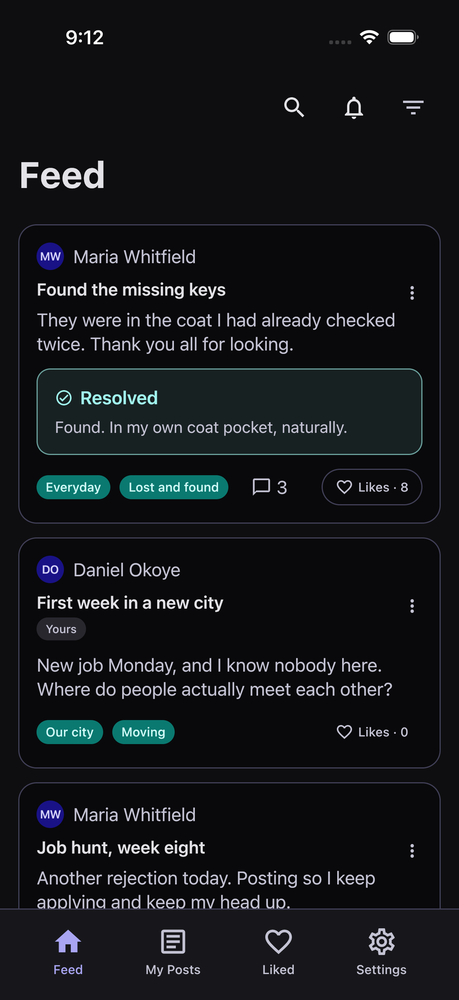 |

## my posts

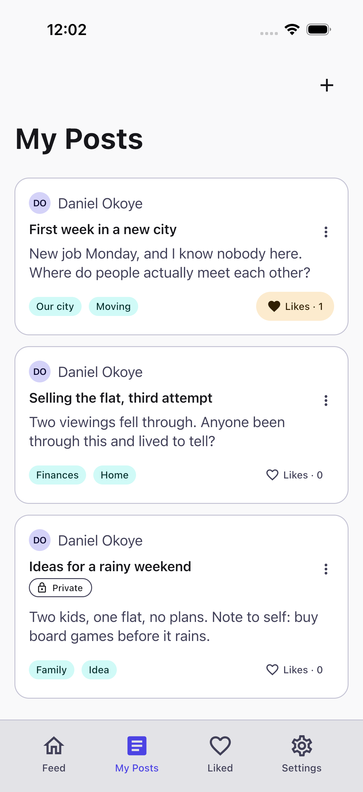

## add post

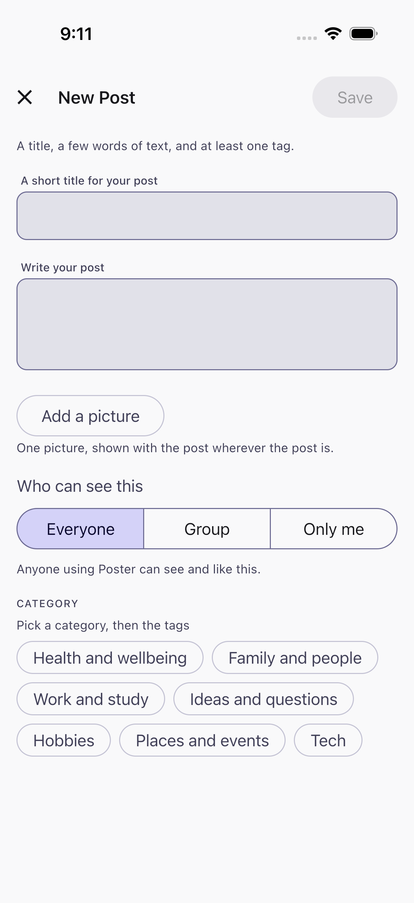

## delete confirmation

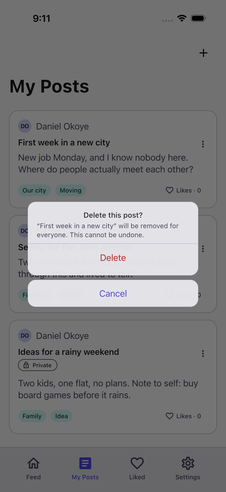

## liked

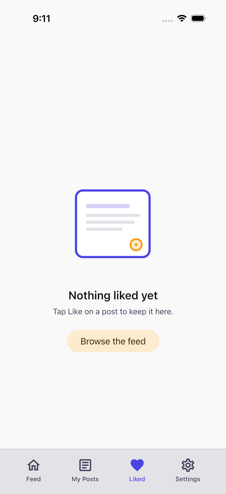

## settings

| Light | Dark |
|---|---|
| 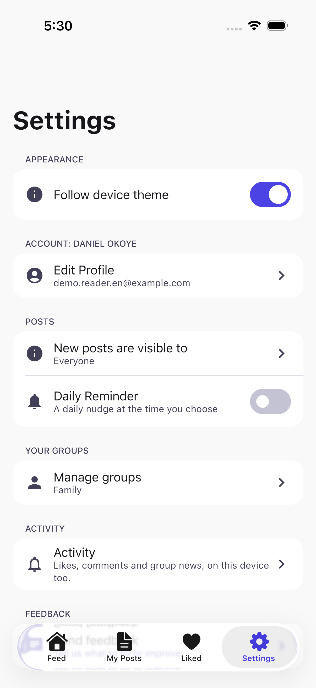 | 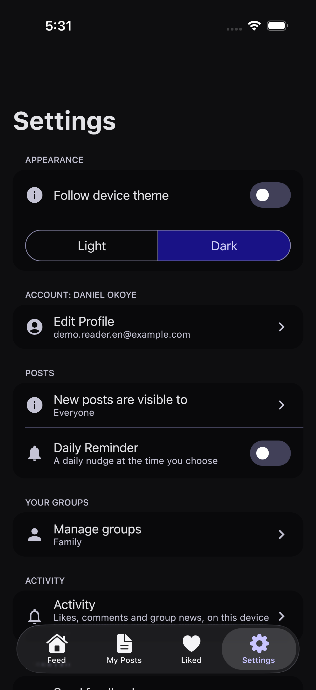 |

## groups

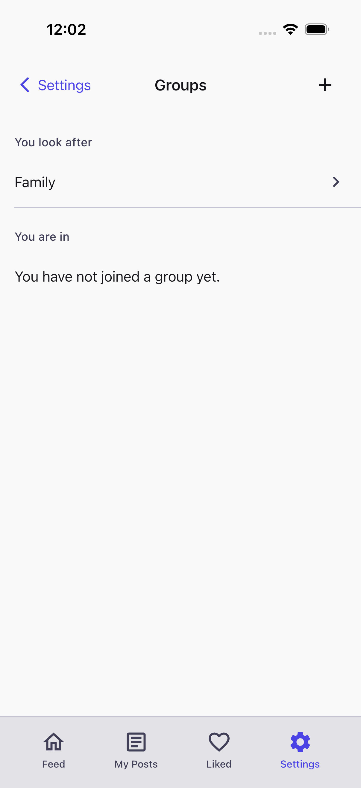

## post details

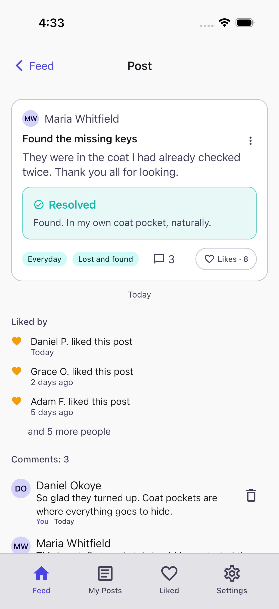

## support paywall

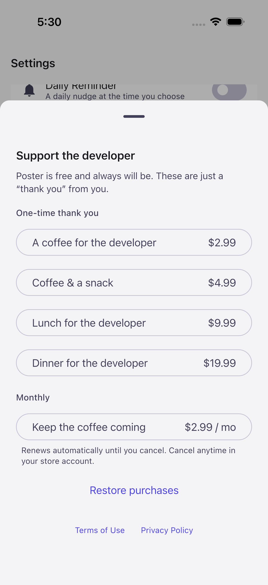

## profile

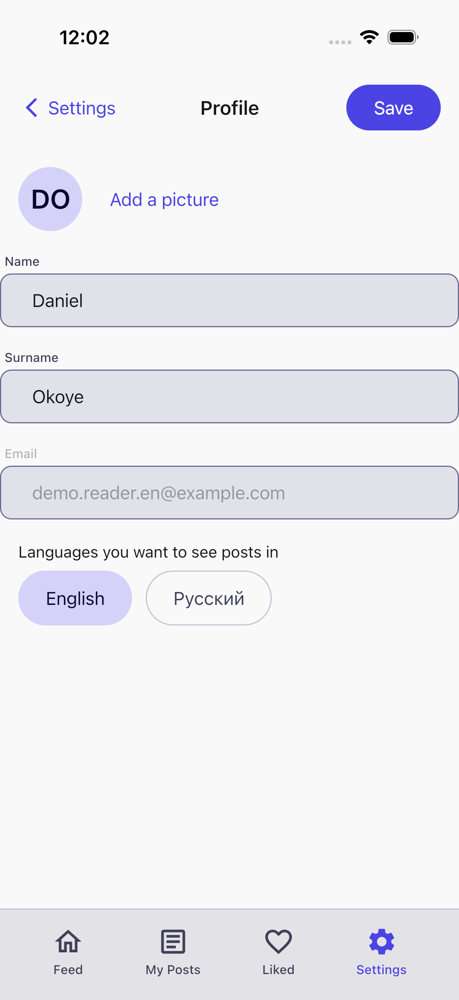

## 00-login

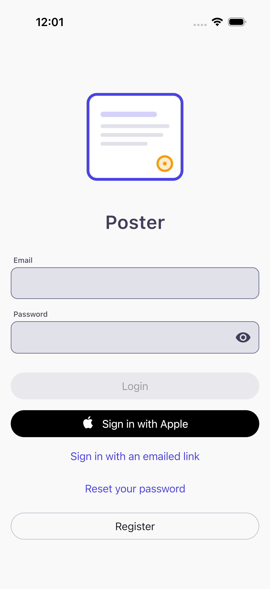

## 00b-register

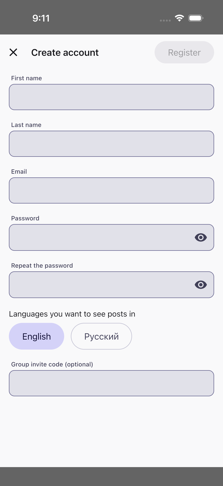

