# iPad screenshots

Captured from the running app with demo data, in the default palette. How: `scripts/ios-screenshots.sh --sim "iPad Pro 11-inch (M5)"`: the same XCUITest run on an iPad, where the tabs sit in the left rail and the post opens beside the list.

[← README](../README.md) · other platforms:
[Android](android.md) · [iOS](ios.md) · [iOS, Liquid Glass tab bar](ios-liquid.md) · [Desktop (JVM)](desktop.md) · [Web (Kotlin/Wasm)](web.md) · 

## home

<table><tr><th>Light</th><th>Dark</th></tr><tr><td>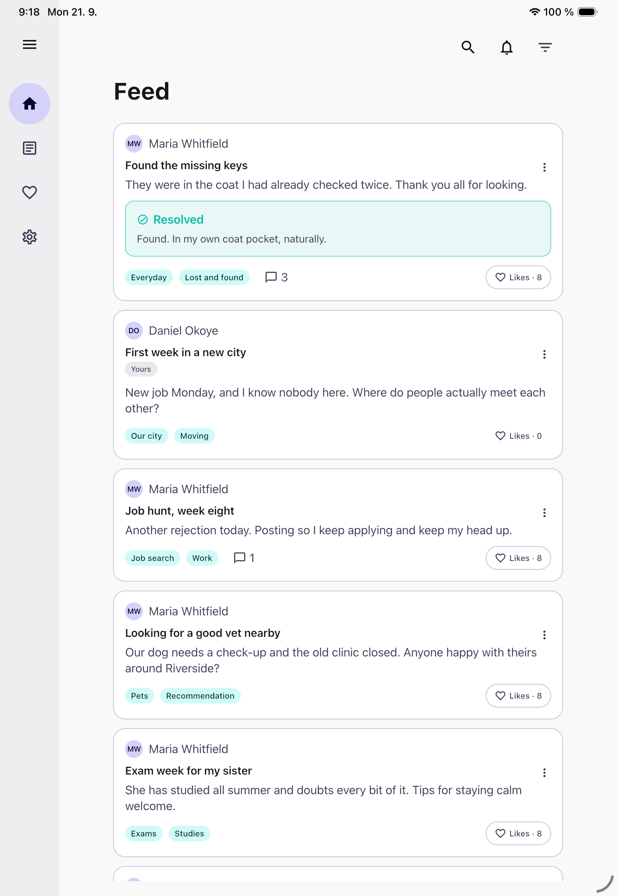</td><td>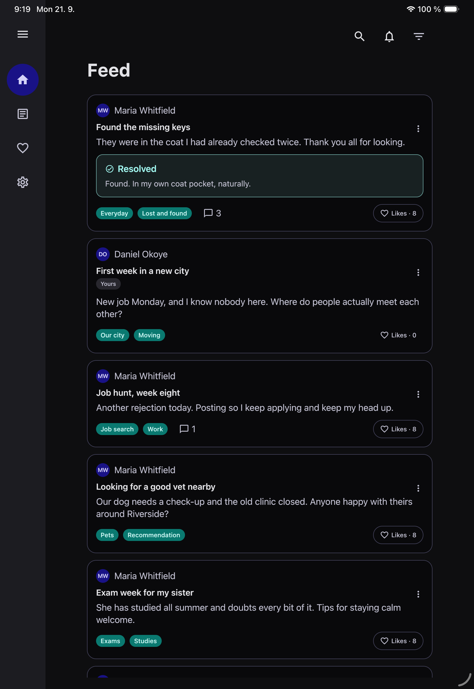</td></tr></table>

## my posts

<table><tr><td>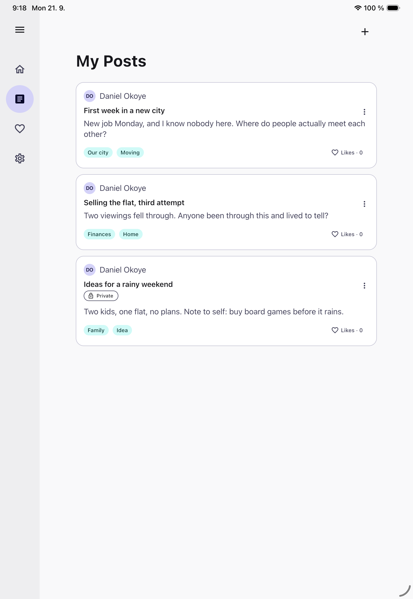</td></tr></table>

## add post

<table><tr><td>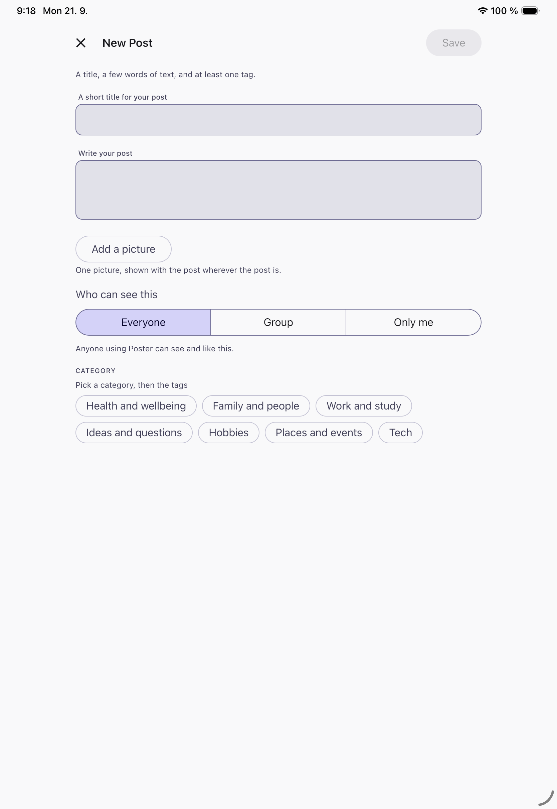</td></tr></table>

## delete confirmation

<table><tr><td>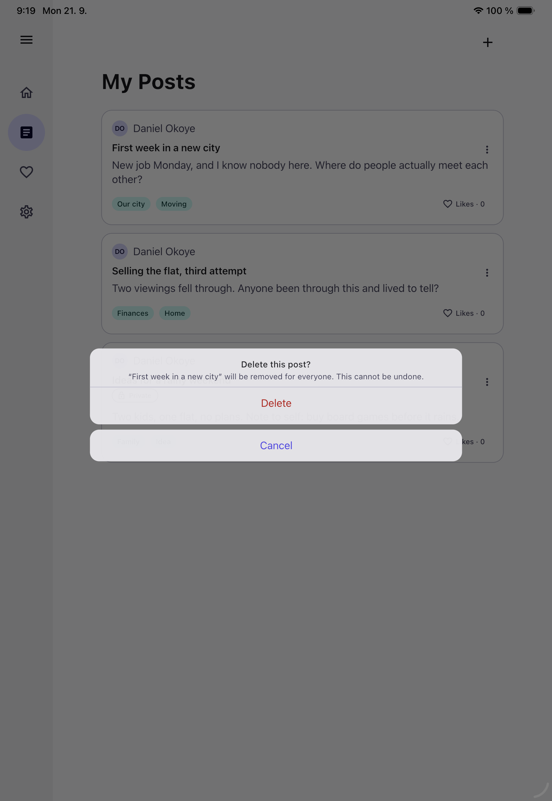</td></tr></table>

## liked

<table><tr><td>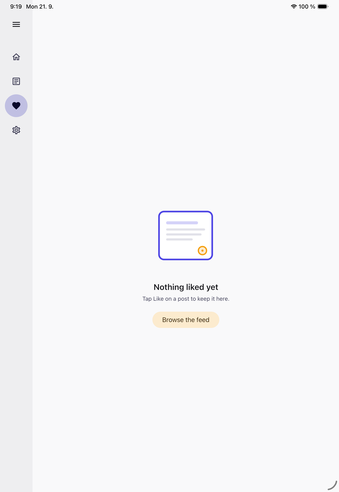</td></tr></table>

## settings

<table><tr><th>Light</th><th>Dark</th></tr><tr><td>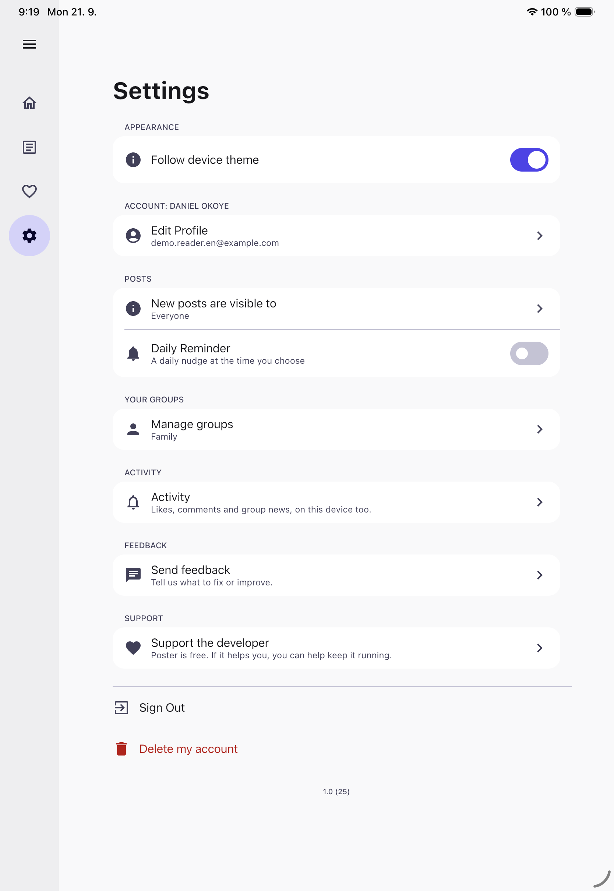</td><td>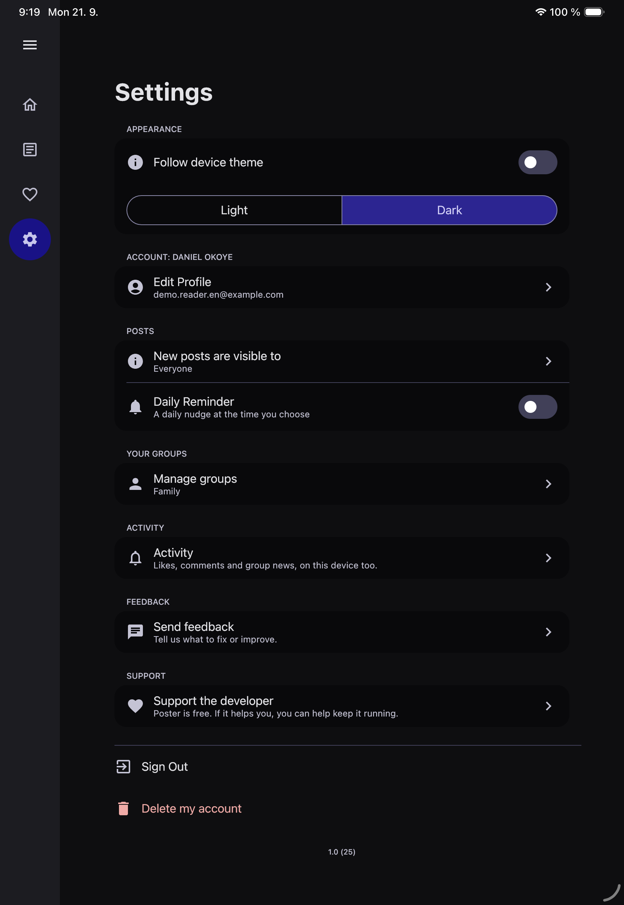</td></tr></table>

## groups

<table><tr><td>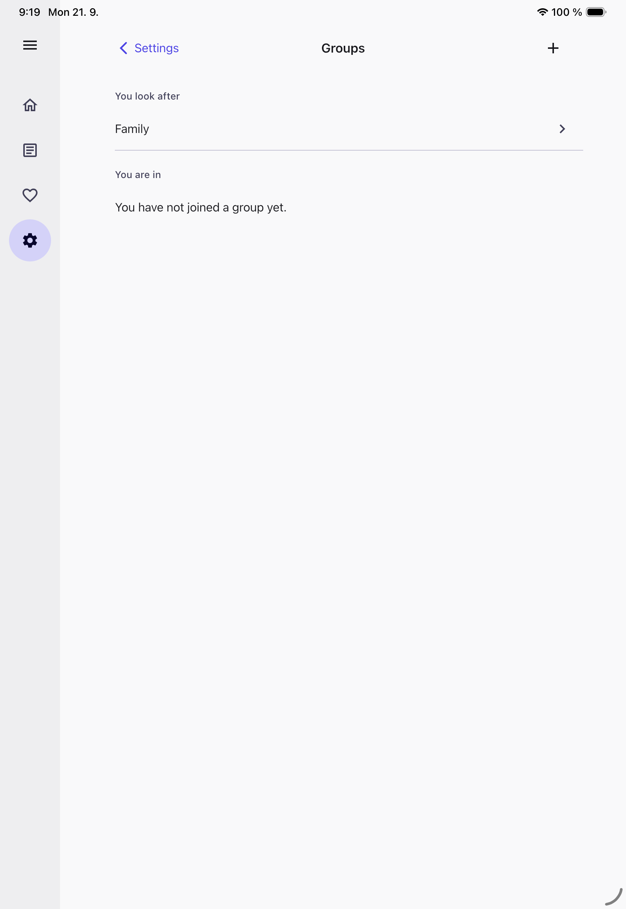</td></tr></table>

## post details

<table><tr><td></td></tr></table>

## post comments

<table><tr><td>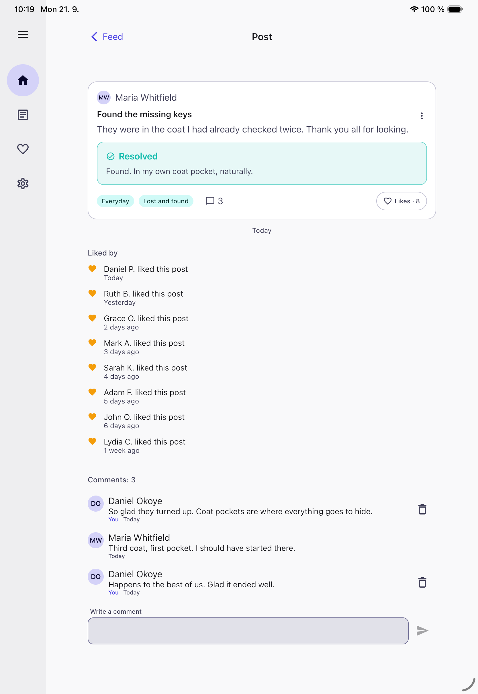</td></tr></table>

## support paywall

<table><tr><td>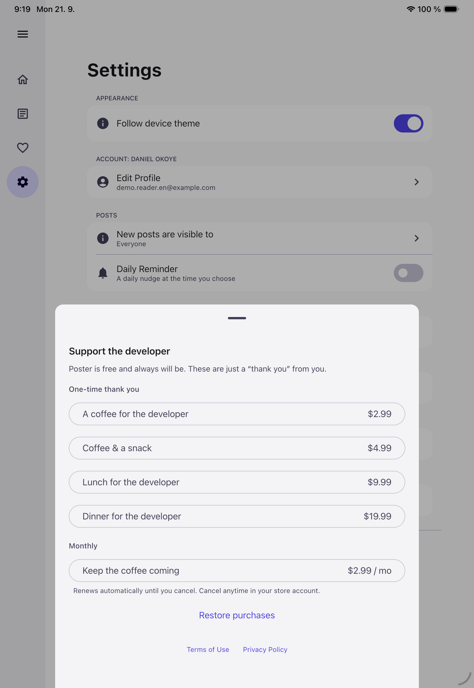</td></tr></table>

## profile

<table><tr><td>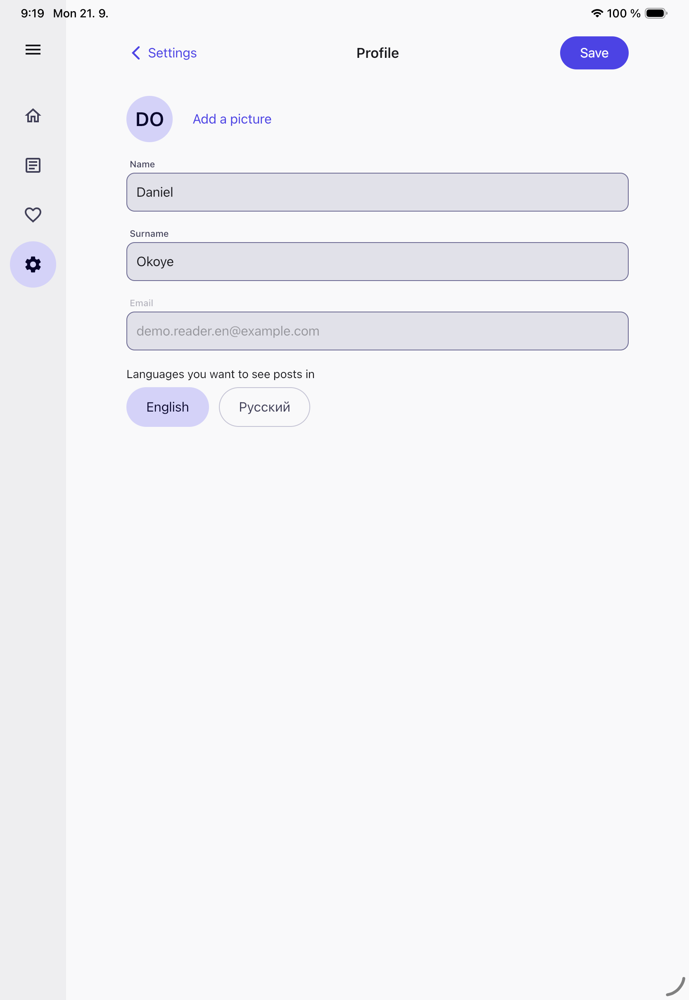</td></tr></table>

## 00-login

<table><tr><td>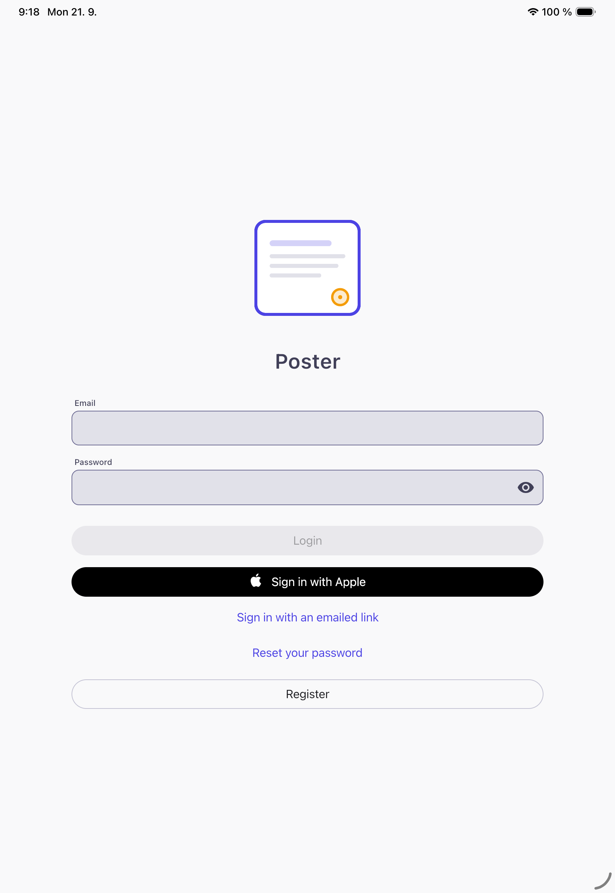</td></tr></table>

## 00b-register

<table><tr><td>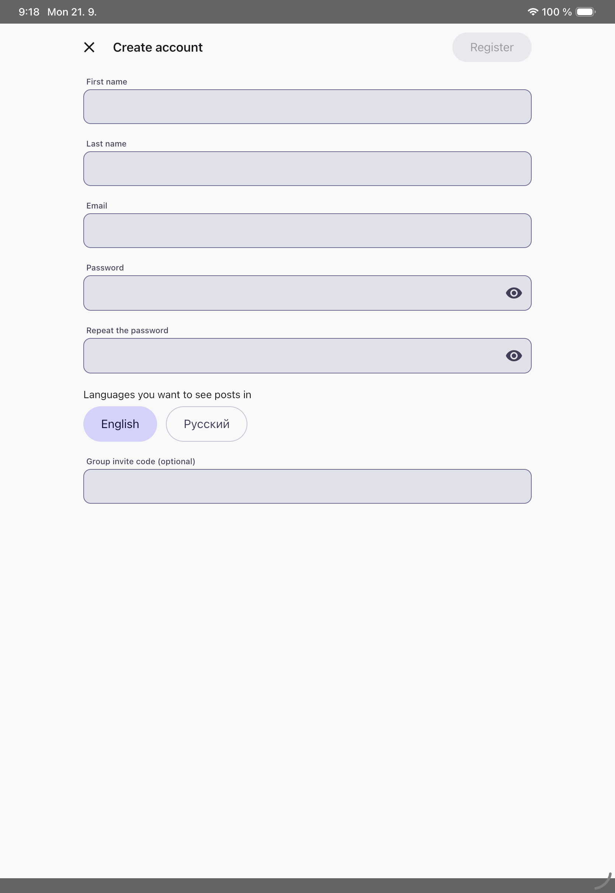</td></tr></table>

