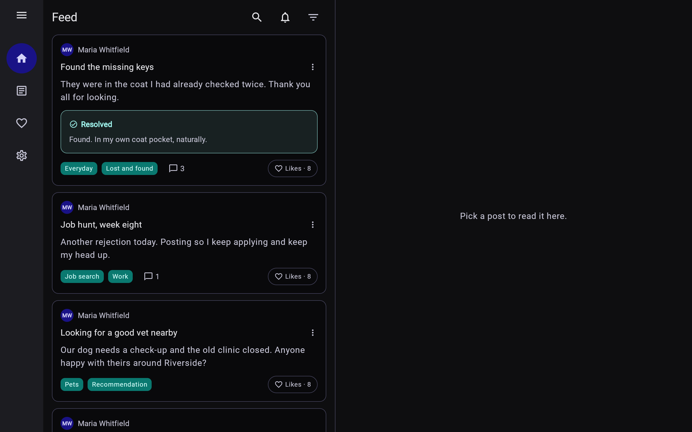
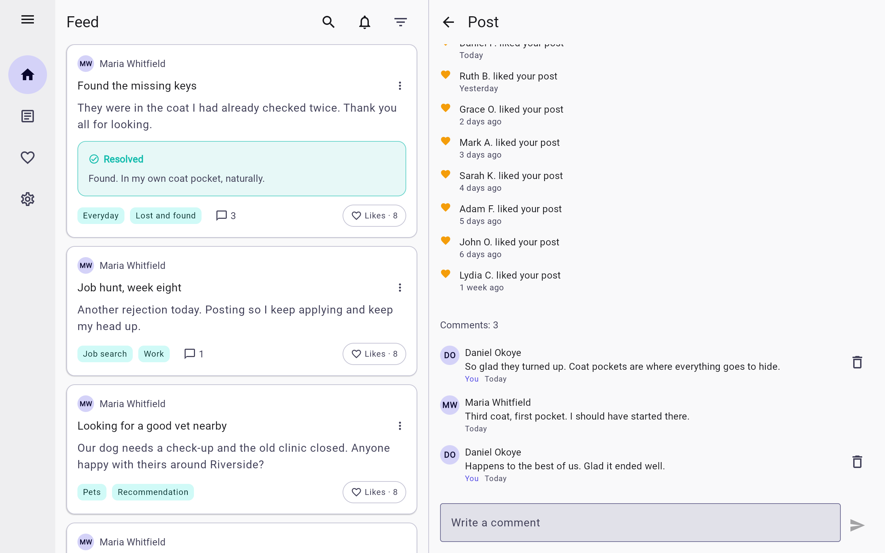
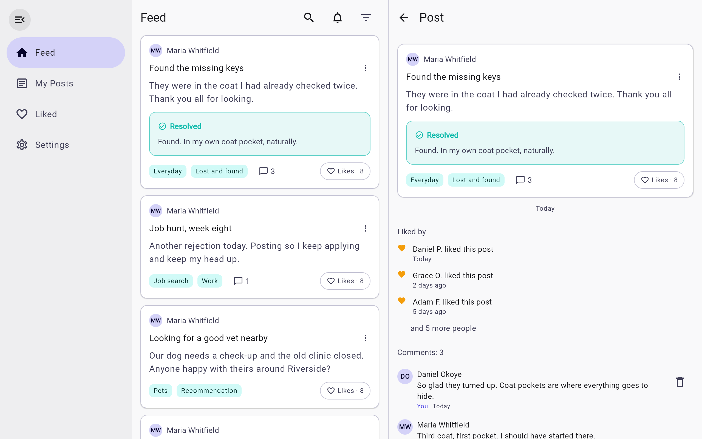

# Web (Kotlin/Wasm) screenshots

Captured from the running app with demo data, in the default palette. How: `scripts/web-screenshots.sh`: headless Chrome over the DevTools protocol against the bundle the Ktor server hosts under `/app` (docs/Web.md).

[← README](../README.md) · other platforms:
[Android](android.md) · [iOS](ios.md) · [iOS with the native bar turned off](ios-docked.md) · [iPad](ipad.md) · [Desktop (JVM)](desktop.md) · 

## feed

<table><tr><th>Light</th><th>Dark</th></tr><tr><td></td><td></td></tr></table>

## my posts

<table><tr><td></td></tr></table>

## liked

<table><tr><td></td></tr></table>

## settings

<table><tr><td></td></tr></table>

## wide feed

<table><tr><th>Light</th><th>Dark</th></tr><tr><td></td><td></td></tr></table>

## wide details

<table><tr><td></td></tr></table>

## wide comments

<table><tr><td></td></tr></table>

## wide rail expanded

<table><tr><td></td></tr></table>

