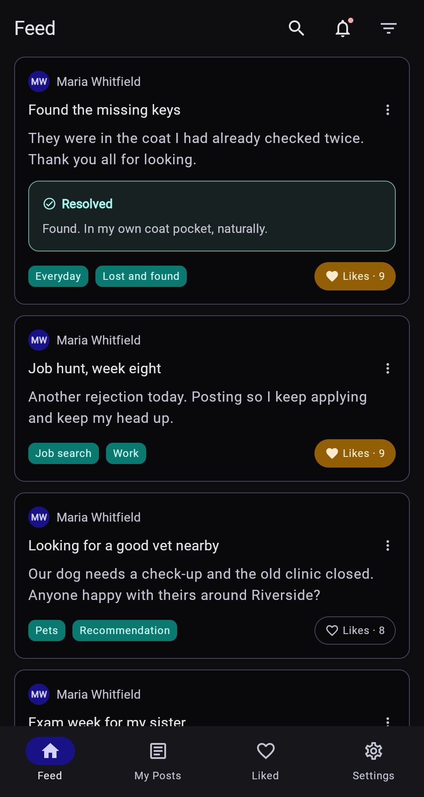
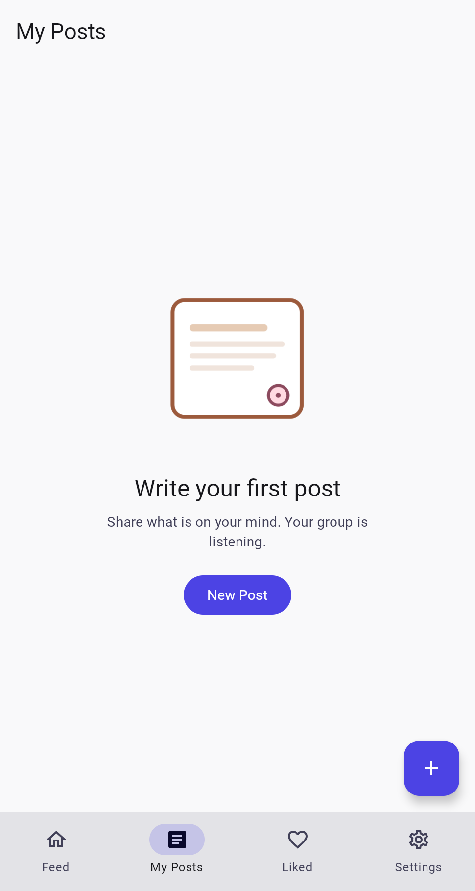
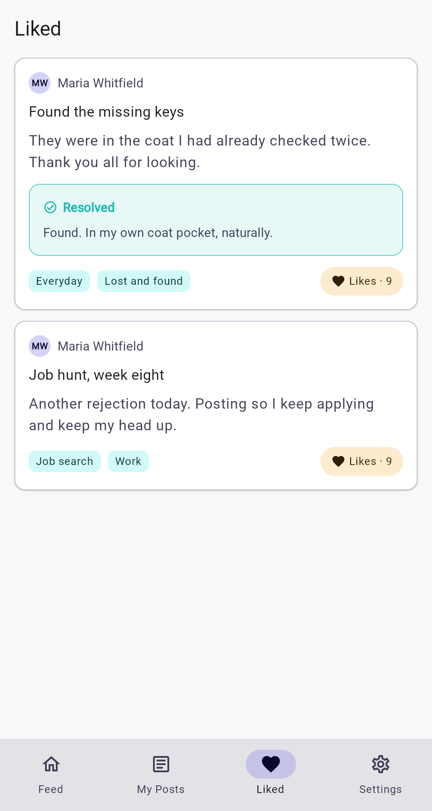
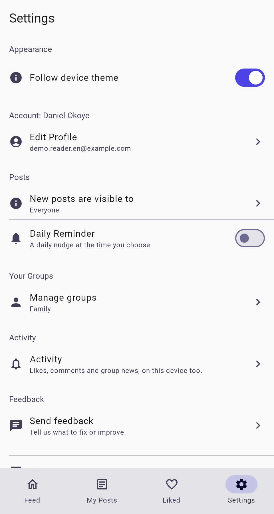
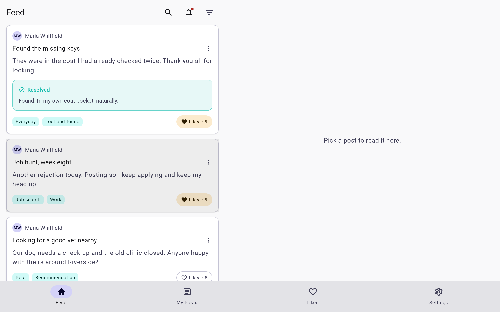

# Web (Kotlin/Wasm) screenshots

Captured from the running app with demo data, in the default palette. How: `scripts/web-screenshots.sh`: headless Chrome over the DevTools protocol against the bundle the Ktor server hosts under `/app` (docs/Web.md).

[← README](../README.md) · other platforms:
[Android](android.md) · [iOS](ios.md) · [Desktop (JVM)](desktop.md) · 

## feed

| Light | Dark |
|---|---|
|  |  |

## my posts

## liked

## settings

## wide feed

## wide details

